# Strat Creator

Takes approved RFEs, which describe the **WHAT and WHY**, and produces the **HOW**: actionable implementation strategies grounded in real platform architecture.

The pipeline checks technical feasibility against architecture context and scores every strategy so the team knows what's ready and what needs attention. The full lifecycle spans two pipelines (rfe-creator and strat-creator), Jira, CI automation, and human review in Claude Code.

## How It Works

```mermaid
flowchart LR
    A["RFE Idea"] --> B["RFE Creation\n(rfe-creator)"]
    B --> C["RFE Assessment\n(rfe-creator)"]
    C --> D["RFE Submission\n(rfe-creator)"]
    D --> E["Discovery &\nFiltering"]
    E --> F["Strategy\nCreation"]
    F --> G["Strategy\nRefinement"]
    G --> H["Strategy\nReview"]
    H --> I["Human Review\n& Sign-off"]
    I --> J["Feature-Ready\nStrategy"]

    style B fill:#e3f2fd,stroke:#1565c0
    style C fill:#e3f2fd,stroke:#1565c0
    style D fill:#e3f2fd,stroke:#1565c0
    style E fill:#fff3e0,stroke:#e65100
    style F fill:#fff3e0,stroke:#e65100
    style G fill:#fff3e0,stroke:#e65100
    style H fill:#fff3e0,stroke:#e65100
    style I fill:#e8f5e9,stroke:#2e7d32
    style J fill:#e8f5e9,stroke:#2e7d32
```

**Legend:** Blue = rfe-creator (upstream) | Orange = strat-creator (CI) | Green = Human workflow

## Who Does What

| Role | Touchpoints | Start Here |
|------|------------|------------|
| **Product Manager** | Create RFEs in Jira, track strategy progress, review verdicts | [PM Workflow](workflow-guide/product-managers.md) |
| **Staff Engineer / Architect** | Review strategies in Claude Code, contribute overlays, sign off | [Staff Engineer Workflow](workflow-guide/staff-engineers.md) |
| **Engineering Manager** | Monitor dashboard, configure batches, triage needs-attention | [EM Workflow](workflow-guide/engineering-managers.md) |

New to the project? Start with [Getting Started](getting-started.md) to set up your environment.

## Pipeline at a Glance

| Stage | Owner | Input | Output |
|-------|-------|-------|--------|
| [RFE Creation](pipeline-stages/rfe-creation.md) | rfe-creator | Problem statement | RHAIRFE ticket |
| [RFE Assessment](pipeline-stages/rfe-assessment.md) | rfe-creator | RHAIRFE ticket | Scored, feasibility-checked RFE |
| [RFE Submission](pipeline-stages/rfe-submission.md) | rfe-creator | Passing RFE | Labeled RHAIRFE in Jira |
| [Discovery & Filtering](pipeline-stages/rfe-discovery-filtering.md) | strat-creator | Jira query | Batch of eligible RFEs |
| [Strategy Creation](pipeline-stages/strategy-creation.md) | strat-creator | RHAIRFE | RHAISTRAT stub |
| [Strategy Refinement](pipeline-stages/strategy-refinement.md) | strat-creator | RHAISTRAT stub | Full strategy with HOW |
| [Strategy Review](pipeline-stages/strategy-review.md) | strat-creator | Refined strategy | Scored + reviewed strategy |
| [Human Review](pipeline-stages/human-review-signoff.md) | Staff Engineer | Scored strategy | Feature-ready strategy |
