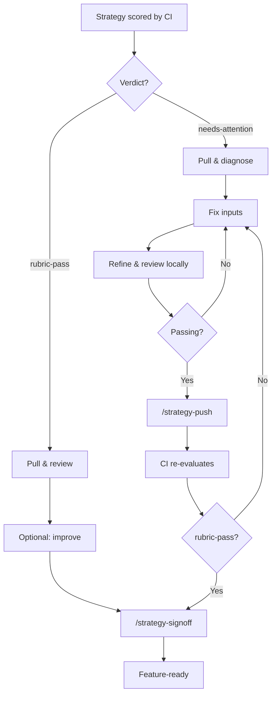

# Human Review & Sign-off

> **Owner:** Staff engineers / architects
> **Last verified:** 2026-05-21

## What Happens

Every strategy requires a human in the loop before becoming feature-ready. The path depends on CI's verdict.



## Commands

| Command | Purpose |
|---------|---------|
| `/strategy-pull RHAISTRAT-NNNN` | Fetch strategy into `local/` workspace |
| `/strategy-refine RHAISTRAT-NNNN` | Regenerate strategy incorporating your input |
| `/strategy-review RHAISTRAT-NNNN` | Re-score strategy locally |
| `/strategy-push RHAISTRAT-NNNN` | Push needs-attention fixes back to Jira, resubmit to CI |
| `/strategy-signoff RHAISTRAT-NNNN` | Sign off a rubric-pass strategy as feature-ready |

## How to Know When CI Finishes

After pushing a needs-attention strategy back with `/strategy-push`, CI will re-evaluate it. To check if CI is done:

1. **Check Jira labels**: Look for `strat-creator-rubric-pass` or `strat-creator-needs-attention` on the RHAISTRAT ticket (the `strat-creator-processing` label is removed when CI finishes)
2. **Check the dashboard**: The [strat-dashboard](https://strat-dashboard-0f1209.gitlab.io/) shows the latest run status and which strategies were processed

## Dry-Run Mode

To test changes locally without writing to Jira, add `--dry-run` to refine and review commands:

```bash
claude "/strategy-refine RHAISTRAT-NNNN --dry-run"
claude "/strategy-review RHAISTRAT-NNNN --dry-run"
```

This produces all local artifacts but skips Jira writes.

## Fix Strategies (Priority Order)

1. **Overlays** (preferred): Fix the root cause in architecture-context for all future strategies
2. **Staff Engineer / SME Input**: One-off corrections specific to this strategy
3. **Contact maintainers**: For major structural changes to architecture-context

See the [Staff Engineer Workflow Guide](../workflow-guide/staff-engineers.md) for detailed instructions.

## What "Feature-Ready" Means

When `/strategy-signoff` completes:

- Strategy content is pushed to Jira
- Review summary is posted as a Jira comment
- Full review file is attached to the RHAISTRAT ticket
- `strat-creator-human-sign-off` label is applied
- The strategy is ready for backlog grooming and sprint planning
