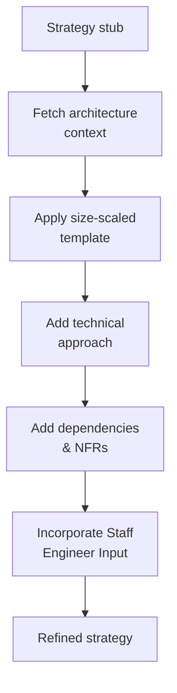

# Strategy Refinement

> **Owner:** strat-creator CI pipeline
> **Last verified:** 2026-05-21

## What Happens

The `strategy-refine` skill transforms the strategy stub into a full implementation plan. It fetches architecture context from [opendatahub-io/architecture-context](https://github.com/opendatahub-io/architecture-context) and uses it to ground the strategy in real platform architecture.

### What Gets Added

- **Technical approach**: How to implement the feature, grounded in actual component architecture
- **Dependencies**: Which components, teams, and APIs are involved
- **Impacted teams/components**: Who needs to coordinate
- **Non-functional requirements**: Performance, security, observability, testing requirements
- **Effort estimate**: Size-appropriate level of detail (S/M/L/XL templates)

### Architecture Context

The refinement stage uses architecture context (component docs, dependency maps) fetched from [opendatahub-io/architecture-context](https://github.com/opendatahub-io/architecture-context). This includes any [overlays](../reference/architecture-context.md) that patch the base context.

### Large Strategy Handling

When a refined strategy exceeds Jira's description size limit (~32K characters), the full strategy is stored as a Jira attachment (`RHAISTRAT-NNNN-strategy.md`) and the Jira description shows a TL;DR stub with a note pointing to the attachment. This is handled transparently by the pipeline.

### Staff Engineer / SME Input

If a `## Staff Engineer / SME Input` section exists in the strategy file, refine incorporates it into the regenerated strategy. This is how human corrections flow into the automated output.

### Labels Applied

- `strat-creator-auto-refined` on the RHAISTRAT ticket

## What Triggers This Stage

- A strategy stub exists from [Strategy Creation](strategy-creation.md)

## What It Produces

- Updated `artifacts/strat-tasks/RHAISTRAT-NNNN.md` with full strategy content
- Architecture context fetched to `.context/architecture-context/`

## Next Stage

[Strategy Review](strategy-review.md): The refined strategy is scored and reviewed.
