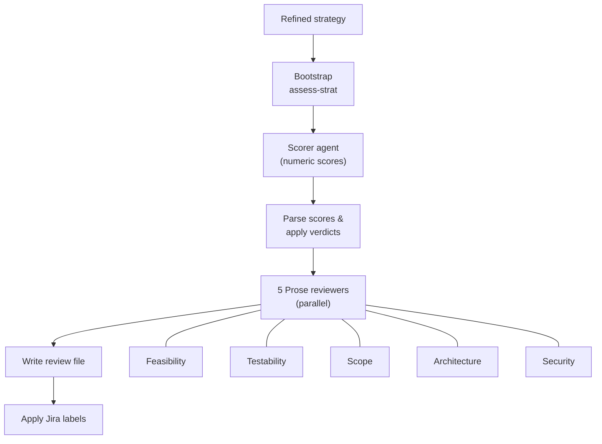

# Strategy Review

> **Owner:** strat-creator CI pipeline
> **Last verified:** 2026-05-21

## What Happens

The `strategy-review` skill orchestrates a two-phase review: numeric scoring followed by prose reviews from independent reviewers.

### Phase 1: Numeric Scoring

A restricted scorer agent (`strat-scorer`) evaluates the strategy against 4 dimensions:

| Dimension | What It Checks | Score Range |
|-----------|---------------|-------------|
| **Feasibility** | Can we build this with the proposed approach? | 0-2 |
| **Testability** | Are acceptance criteria measurable? | 0-2 |
| **Scope** | Is this right-sized? Does effort match scope? | 0-2 |
| **Architecture** | Do dependencies and integrations check out? | 0-2 |

**Maximum total: 8**

Scores are parsed and verdicts computed deterministically by `parse_results.py` and `apply_scores.py`. No LLM judgment is involved in verdict assignment.

### Verdicts

| Verdict | Condition | Label Applied |
|---------|-----------|---------------|
| **APPROVE** | Total >= 6, no zeros | `strat-creator-rubric-pass` |
| **REVISE** | Total >= 3, at most 1 zero | `strat-creator-needs-attention` |
| **REJECT** | Total < 3 or 2+ zeros | `strat-creator-needs-attention` |

### Phase 2: Prose Reviews

After scoring, 5 independent prose reviewers run in parallel. Each produces narrative feedback on its dimension:

| Reviewer | Focus |
|----------|-------|
| **Feasibility** | Technical viability, implementation complexity, effort credibility |
| **Testability** | Acceptance criteria measurability, edge cases, test strategy |
| **Scope** | Right-sizing, effort/scope matching, RFE coverage |
| **Architecture** | Dependencies, integration patterns, component interactions |
| **Security** | Auth, data protection, cryptographic compliance, supply chain, agent/MCP risks |

!!! note
    The security reviewer is **prose-only**. It does not contribute to the numeric score. It provides narrative feedback on security posture but does not affect the APPROVE/REVISE/REJECT verdict.

Prose reviewers set their own individual verdicts (`reviewers.feasibility`, etc.) for informational purposes, but these do NOT affect the gate decision. The gate is purely numeric.

### Disagreements Are Preserved

If the feasibility reviewer says "this is fine" but the scope reviewer says "this is too big," both views are reported. Reviewers never see each other's output.

## What Triggers This Stage

- A refined strategy from [Strategy Refinement](strategy-refinement.md)

## What It Produces

- `artifacts/strat-reviews/RHAISTRAT-NNNN-review.md`: Review file with scores table and prose from all reviewers
- Jira label: `strat-creator-rubric-pass` or `strat-creator-needs-attention`
- Jira comment: Summary of scores and verdict
- Jira attachment: Full review file

## Next Stage

[Human Review & Sign-off](human-review-signoff.md): A staff engineer reviews the scored strategy and signs off.
